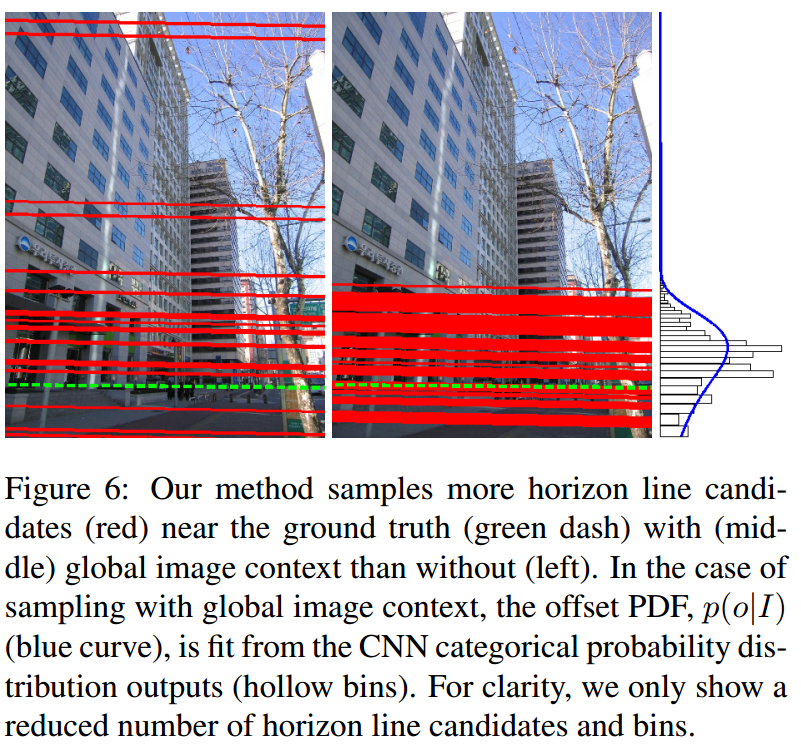
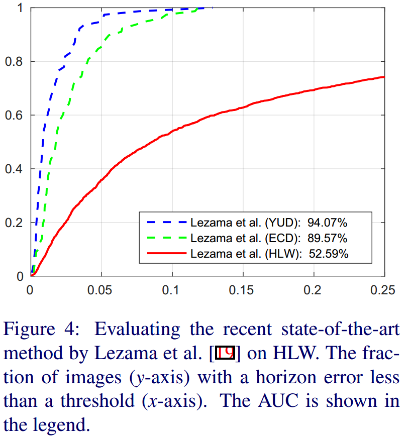

% Vanishing point, horizon line and lane detection
% MiaoDX 缪东旭  MiaoDX@hotmail.com dongxu.miao@horizon.ai
% August, 2018

***
## Papers we will talk about

VPGNet: Vanishing Point Guided Network for Lane and Road Marking Detection and Recognition, Seokju Lee, Junsik Kim, and other 8 people,  ICCV 2017

GIC, Detecting Vanishing Points using Global Image Context in a Non-Manhattan World, Menghua Zhai, Scott Workman, Nathan Jacobs, CVPR 2016

HLW, Horizon Lines in the Wild, Scott Workman, Menghua Zhai, Nathan Jacobs, BMVC 2016

IGP, Deep Learning for Vanishing Point Detection Using an Inverse Gnomonic Projection, Florian Kluger, Hanno Ackermann, Michael Ying Yang, Bodo Rosenhahn, GCPR 2017

# What is VP

***
## Vanishing point

A vanishing point results from the intersection of projections of a set of parallel lines in the world. ..  VPs can typically be classified as either vertical, there is one such VP, and horizontal, there are often many such VPs. -- GIC

{width=55%}

***

A vanishing point is a point where parallel lines in a three-dimensional space converge to a two-dimensional plane by a graphical perspective. 
In this paper, “Vanishing Point (VP)” is defined as the nearest point on the horizon where lanes converge and disappear predictively around the farthest point of the visible lane. -- VPGNet

{width=55%}

***
## Horizon lines

The image location of the horizon line is defined as the projection of the line at infinity for any plane which is orthogonal to the local gravity vector. The gravity vector often coincides with the local ground plane surface normal, but not always. This is distinct from the problem of detecting the skyline, which is the set of points where the sky and the ground meet. -- HLW

***
**Manhattan-world assumption:**  only three mutually orthogonal vanishing directions exist in a scene, as is reasonably common in urban scenes where buildings are aligned on a rectangular grid

**Atlanta-world assumption:**  allows multiple non-orthogonal vanishing directions that are connected by a common horizon line, and are all orthogonal to a single zenith

**No specific assumption**

***
# VPGNet

VPGNet: Vanishing Point Guided Network for Lane and Road Marking Detection and Recognition, Seokju Lee, Junsik Kim, and other 8 people,  ICCV 2017

***

{width=55%}

***

* If the network is trained with a thin lane annotation, the information tends to vanish through convolution and pooling layers
* Most of the neural networks require a resized image (usually smaller than original size), the thin annotations become barely visible
* The image is divided into a grid 8×8 and the grid cell is filled with a class label if any pixel from the original annotation lies within the grid cell.

. . .

{width=55%}

***
### Dataset

* Polygon/pixel-level annotation
    - We manually annotate corner points of lane and road markings. Corner points are connected to form a polygon which results in a **pixel-level mask** annotation for each object. In a similar manner, each pixel contains a **class label**.
* Grid level projection
* Vanishing point
    - We localize the vanishing point in a road scene where parallel lanes supposedly meet. Depending on the scene, a **difficulty level** (EASY, HARD, NONE) is assigned to every vanishing point.

***
### Architecture

{width=75%}

***
* Propose a data layer to induce grid-level annotation that enables training of both lane and road markings simultaneously
* Propose an regression that utilizes a grid-level mask. Points on the grid are regressed to the closest grid cell and combined by a multi-label classification task to represent an object
* For the post-processing, lane classes only use the output of the multi-label task, and road marking classes utilize both grid box regression and multi-label task

***
### VPP (Vanishing Point Prediction Task)

* regression losses 
    - (i.e. L1, L2, hinge losses) that directly calculate pixel distances from a VP
    - difficult to balance the losses with other tasks (object detection/multi-label classification) due to the difference in the loss scale
* cross entropy
    - binary classification method that directly classifies background and foreground
        + Since the vanishing area is drastically smaller than the background, the network is initialized to infer every pixel as background class.

***
The purpose of attaching the VPP task is to improve a scene representation that implies a global context to predict invisible lanes due to occlusions or extreme illumination condition (just like human).

Whole scene should be taken into account to efficiently reflect global information inferring lane locations

* Quadrant mask that divides the whole image into four sections
* Define five channels for the output of the VPP task: one absence channel and four quadrant channels
* Instead of classify the VP, now assign all pixels.

***
{width=75%}

***
### Training

. . .

**Trained together**

* The detection task recognizes objects and covers a local context, while the VPP task covers a global context
* VP provides redundant information to the network, leading to marginal lane detection improvement.

. . .

**Two phases**

* VPP task
    - fix the learning rates to zero for every task except the VPP module
* all tasks (including VPP)
    - balance learning rates
        + $$Loss = w_1L_{reg} + w_2L_{om} + w_3L_{ml} + w_4L{vp}$$
        + where $L_{reg}$ is a grid regression L1 loss, $L_{om}$ and $L_{ml}$ and $L_{vp}$ are cross entropy losses in each branch of the network

***
First, $w_1$∼$w_4$ are set to be equal to $1$, and the starting losses are observed. Then, we set the **reciprocal** of these initial loss values to the loss weight so that the losses are uniform.

In the middle of the training, if the scale difference between losses becomes large, this process is repeated
to balance the loss values.

***

### Post processing

***
**Lane**

* multi-label task

. . .

{width=45%}

The last step is **quadratic regressions** of the lines from the obtained clusters utilizing the location of the VP. If the farthest sample point of  each lane cluster is close to the VP, we include it in the cluster to estimate a polynomial model.

***
**Road marking**

* grid box regression
* multi-label task

. . .

each class in multi-label -> grids in same class -> merging

crosswalks or safety zones (difficult to define by single box) no merging

***
### Analysis

{width=45%}

# GIC

Detecting Vanishing Points using Global Image Context in a Non-Manhattan World, Menghua Zhai, Scott Workman, Nathan Jacobs, CVPR 2016

***
{width=95%}

***

* Dominant trend
    - first find candidate vanishing points, then remove outliers by enforcing mutual orthogonality
* Our method reverses this process
    - we propose a set of horizon line candidates and score each based on the vanishing points it contains
* Global image context
    - extracted with a deep convolutional network, to constrain the set of horizon line candidates (and zenith vanishing point)

***
###  Global Image Context

***
{width=75%}

* equirectangular panoramas downloaded from Google Street View 
* randomly sampled horizontal field-of-view (FOV), yaw, pitch, and roll
* training database contains $110010$ images with known horizon line

***
* Parameterize
    - slope angle $\alpha \in [-\pi,\pi)$
    - offset, $o \in [0; inf)$, which is the shortest distance between the horizon line and the principal point
    - “squash” o from pixel coordinates to the interval $[0; \pi/2)$, through a one-to-one function, $w = tan^{−1}(o/κ)$, in which $κ$ is a scaling factor that affects how dense the sampling is near the center of the image

***
* Train
    - AlexNet
    - remove the original fully connected layers (‘fc6’–‘fc8’)
    - add two disjoint sets of fully connected layers (‘fc6α’–‘fc8α’ and ‘fc6w’–‘fc8w’), one for each target label, $\alpha$ and $w$. 
    - We convert the slope, α, and the squashed offset, w, into independent categorical labels by uniformly dividing their respective domains into 500 bins.

***
* Make output continuous
    - Given image
    - The network outputs a categorical probability distribution for the slope, α, and squashed offset, w. 
    - Make these distributions continuous by approximating them with a Gaussian distribution
    - Estimate the mean and variance from $5000$ samples generated
from the categorical probability distribution

. . .

{width=45%}

***
### Horizon-First Vanishing Point Detection

***
* Pipeline
    - Given Image
    - Distributions estimated from global image context
    - line segments extracted with LSD

. . .

{width=75%}

***
{width=75%}

***
{width=95%}

***
{width=90%}

***
# HLW

HLW, Horizon Lines in the Wild, Scott Workman, Menghua Zhai, Nathan Jacobs, BMVC 2016

***

* Existing methods
    - **typically require** the image to contain specific **cues**
    - such as vanishing points, coplanar circles, and regular textures
    - limiting their real-world applicability
* Our method
    - investigate the application of convolutional neural networks for directly estimating the horizon line
    - without requiring any **explicit** geometric constraints or other special cues
    - resulting network **implicitly** combines both geometric and semantic cues, makes no explicit assumptions about the contents of the underlying scene
    - Data Driven

***

## Contributions

* A novel approach for using structure from motion to automatically label images with a horizon line
* A large evaluation dataset of images with labeled horizon lines
* A CNN-based approach for directly estimating the horizon line in a single image, and
* An extensive evaluation of a variety of CNN design choices

***

### Related dataset status

{width=75%}

***
* ECD, Eurasian Cities Dataset, 103 outdoor images captured in large urban areas, Atlanta-world assumption
* YUD, York Urban Dataset, 102 images, Manhattan-world assumption, no camera 
roll

* Pipeline
    - detect line segments, find vanishing points, then globally optimize to find a consistent scene interpretation. The reliance on vanishing points limits these methods to regions with many man-made structures

***
### The dataset acquisition

* Leveraging Structure from Motion
    - The output of SfM is the extrinsic and intrinsic camera parameters for a subset of the input images
    - Assume that the expected roll of a camera is zero
    - 100553 images

. . .

{width=65%}

***
* Street-side Imagery
    - SfM are mostly of tourist landmarks
    - Lack many other scenes, e.g forests, crop fields, industrial parks, and residential streets
    - rectilinear cutouts extracted from equirectangular street-side imagery panoramas (via Google Street View)
    - 500000 images

. . .

{width=65%}

* Notation
    - represent the horizon line as $\rho = xcos\theta + ysin\theta$
    - $\rho$ is the perpendicular distance from the origin to the horizon line - $\theta$ is the angle the horizon line makes with the horizontal axis

***
{width=65%}

***
### Direct Horizon Line Estimation

***
* GoogleNet, similar accuracy, but many fewer parameters
* Images have fixed size and a square aspect ratio
    - maximal square center crop 
    - dense grid if using an aggregation strategy
    - reshape the image to be square, but the resulting networks were far less accurate
* Parameterizations
    - slope/offset, $(\theta; \rho)$
    - left/right, $(l; r)$
    -  $\rho$, $l$, and $r$ in units of image heights

***
* CNN variants
    - Classification Approach
        + primary benefit: the output of a CNN trained for a one-of-many classification task is a probability distribution over the categories
        + Each parameter we generate N = 100 bins by linearly interpolating the cumulative distribution function of that parameter over the training data
    - Regression Approach
        + widely seen as more challenging than classification due to difficulties in controlling the optimization process and handling outliers
        + typically performed using the L2 loss, but outliers reduce the generalization ability of the network and increase the convergence time
        + minimize the Huber loss, a robust loss function that is less sensitive to outliers

. . .

{width=35%}

***
### Aggregating Estimates Across Subwindows
* Project the horizon line from the subwindow to the full-size image and averaging in image space (weighted by the confidence in each estimate)
* Optimize for the horizon line in the full image that is maximally likely in all subwindows

. . .

{width=35%}

$W$ is a function that maps the global horizon line, $\Theta$, into the coordinate frame for subwindow $I_i$, and extracts the probability.

***
### Result

***
{width=85%}

***
{width=75%}

***
## Comments

***
### Quick Review

. . .

VPGNet: Vanishing Point Guided Network for Lane and Road Marking Detection and Recognition, Seokju Lee, Junsik Kim, and other 8 people,  ICCV 2017

. . .

GIC, Detecting Vanishing Points using Global Image Context in a Non-Manhattan World, Menghua Zhai, Scott Workman, Nathan Jacobs, CVPR 2016

. . .

HLW, Horizon Lines in the Wild, Scott Workman, Menghua Zhai, Nathan Jacobs, BMVC 2016

***
### Speed

The optimization way is slow, too slow to be practical on ADAS systems, the End-to-End can be fast, but it will face the challenge of interpretability.

VPGNet, NVIDIA GTX Titan X, 20 Hz, forward pass 30 ms, post-processing 20 ms or less

GIC, average of 1 second per image, 3s on ECD dataset

HLW, milliseconds per image